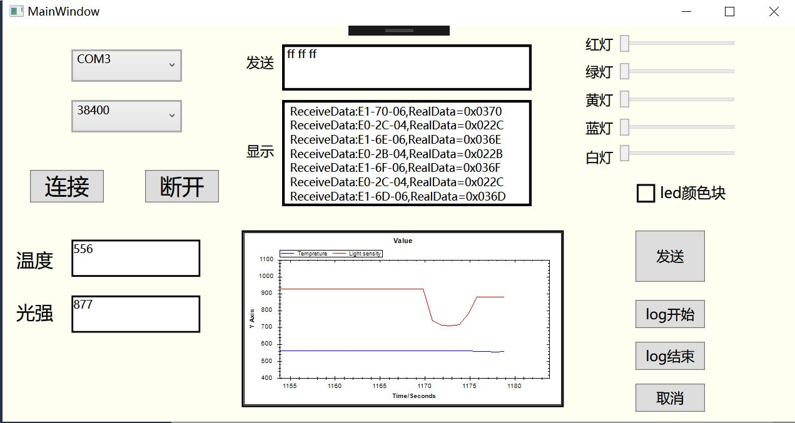
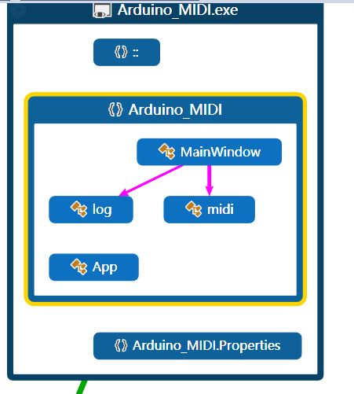

# 实验说明

## 实验题目

+ C# .NET 综合应用程序开发

## 功能概述

+ 程序运行效果图
  
+ 该程序为使用wpf实现的app应用，能够实现pc和arduino的数据交互图形化可视界面呈现
+ 用户可在发送框中发送指定的midi命令，arduino执行相应的操作。显示框中显示arduino传给pc的midi格式数据；下方的zedgraph中在pc收到温度和光强数据时进行曲线绘图；用户可拉动led的滑动条对led的亮度进行控制；log开始可对温度，光强，led的pwm状态数据进行日志记录，文件格式为json；log结束可对日志文件进行保存；取消按钮将丢弃当前日志的记录数据。

## 项目特色

+ 界面设计整洁美观，控件可随界面缩放自动改变大小
+ Pc与arduino进行数据交互时采用简单易懂的midi协议，app能对midi格式的数据进行接收与发送
+ 显示框能实时显示pc接收数据，且将温度和光强数据分离出来单独显示在相应的文本框中，方便用户阅读。程序将物理值转化为实时图形曲线，用户可自行滑动改变坐标刻度观察图形曲线
+ 用户可通过拖动led的滑动块控制led灯的亮度，方便快捷，而不需要发送指定的midi命令，且led的颜色块通过混合显示在下方颜色块中
+ 用户可通过log开始按钮记录实时通讯数据，也可随时取消当前所记录的日志记录。通过log结束按钮保存所记录的日志文件，文件形式为json，简单易懂，方便用户查阅。记录日志文件采用异步写日志的方式，不会对当前的程序线程造成干扰。文件名称默认为当前保存的时间。

## 代码总量

+ Arduino代码：263行
+ 界面设计Mainwindow xaml：337行
+ 界面事件Mainwindow.xaml.cs：505行
+ Midi数据类midi.cs：234行
+ 日志类log.cs：101行

## 工作时间

+ 两天时间了解midi数据格式并完成arduino代码的设计
+ 五天的时间设计程序界面，程序的设计和调试

## 知识点总结图

## 结论

+ 完成本次实验的前提是翻阅资料了解midi形式存储数据的方式，注意数据的有效位数比较特殊，在实现程序功能时应多加注意
+ 使用串口调试程序对arduino代码的正确性进行检测，将正确的程序代码烧进arduino板子中
+ 进行界面设计时控件布局要整洁美观，能够随着界面的缩放自动改变大小
+ 界面控件的数据更新使用了数据绑定的方法，简化了程序设计的复杂性，避免ui更新的冲突
+ 此次程序参阅了很多资料和文档，了解了pc和arduino数据交互的方式，通过数据交互对arduino电路进行用户定制化的控制
+ 在记录日志时，用注意使用异步记录，保证日志的记录不会对当前线程造成干扰和打断，影响程序的正常执行
