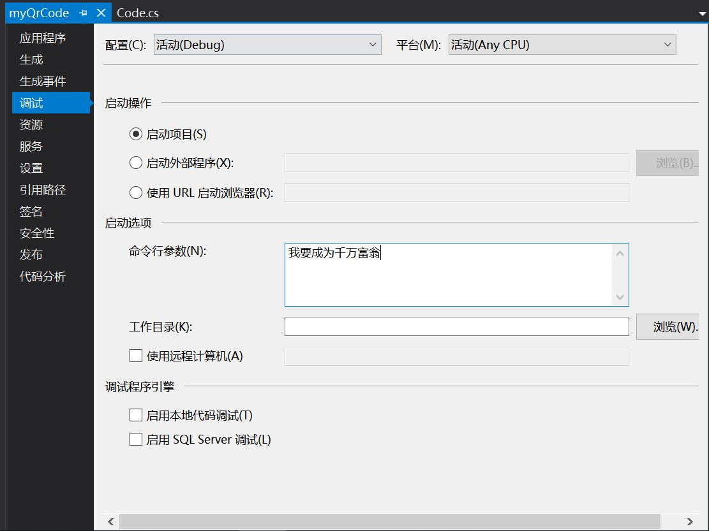

# 《C#控制台编程》  实验报告
**学院：软件学院  班级：软工三班  学号：3017218135  姓名：全康连  日期：2019.03.14**

## 一.功能概述
1. 用户可在命令行窗口输入参数生成QrCode, 程序会对参数进行判断其是否符合程序中命令参数的要求（如自定义长度）。
若符合要求则生成QrCode并将由黑白字符方块组成的编码矩阵在控制台屏幕输出；若命令不符合要求则程序会提示
用户输入正确信息，运行结束

+ 命令行输入编码信息(不包含文件路径)

+ 控制台输出结果

+ 手机扫描识别成功

2. 用户可在命令行输入参数时传入一个包含了编码QrCode信息的文件路径（相对路径或绝对路径），形式为 **myqrcode -fdata\qrcode.txt。
程序会从文件中逐行读入参数信息，生成QrCode并将矩阵图片以.png或.bmp的格式保存在文件中，保存的文件名以参数所在
行号三位数+信息前四个字符构成，该参数输入方式不会将二维码矩阵输出到控制台屏幕上

+ 命令行中包含文件路径

+ 输出结果

+ 手机扫描识别成功

## 二. 项目特色
1. 为用户提供了两种输入生成QrCode信息的方式，满足了用户的需求多样化

2. 第一种参数方式提供了临时QrCode，生成的一次性Q人Code不需保存，不占用内存空间：
第二种参数方式生成的QrCode保存在文件中，可长期使用。此场景应用于大量快速生成二维码图片的应用
场合，如支付宝贴纸。

## 三. 代码总量
1. 该程序由三个函数组成。CreateQrCode用于根据不带文件的命令行参数生成临时QrCode；
SaveQrCode用于读取文件并保存二维码图像。而Main静态函数用于函数运行实现其功能

2. 代码总量为100行

## 四. 工作时间
+ 时间复杂度与输入参数有关,假设参数个数为n
	+ 参数中没有文件名：O(n)
	+ 参数中有文件名,且文件中行数为m：O(m+n)
+ 完成本次实验用了三个晚上。一个晚上用来思考程序的分块设计，需要哪些函数和引用集等；两个晚上用来实现设计

## 五. 知识点总结图

## 六. 结论
1. 此次实验目的在于：
	+ 熟悉并掌握C#控制台编程方式
	+ 掌握C#控制台程序的命令行参数读取方法
	+ 理解QrCode的编码基本原理
	+ 学会使用第三方已经完成的NuGet安装包

2. 实验编程需要安装QrCode.Net安装包，其中的详细使用方法须在官网上去详细查看并理解方法的功能

3. 在此次实验中，还需进行文件的读写操作，实验者需自行查阅C#的相应文档并实现其功能

4. 本次实验收获颇丰，学会了QrCode.Net基本方法的使用，理解QrCode编码的基本原理，还学会了文件的读写方法

5. 实验中需注意使用安装包相应功能时需注明引用集，在进行文件读写操作时要考虑异常的抛出并进行相应的处理

6. 本次实验的程序只实现了读取文本文件进行编码QrCode的简单功能，还可以进行功能拓展。如读取Excel文件和后台连接数据库大量生成QrCode的功能

